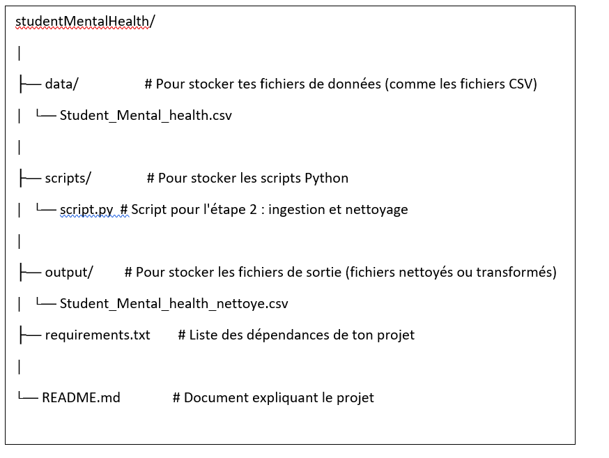

# Student_Mental_Health
## Projet : Student Mental Health
## Source de Données : Kaggle(fichier csv)
https://www.kaggle.com/datasets/shariful07/student-mental-health/data
## Langage : Python
## Editeur de texte : Pycharm
## Architecture du projet
 

## Comment récuperer le projet et l' éxecuter en local ?

### 1. Cloner le Projet depuis GitHub
#### git clone <URL_DU_REPO>
### 2. Naviguer dans le Répertoire du Projet
#### cd chemin\vers\le\projet

### 3. Créer l'environnement virtuel
#### c'est quoi un environnement virtuel ?
#### Un environnement virtuel est un environnement dans lequel est installer tous les paquage necessaire au developpement d’un projet. Il est propre a un projet et permet :
##### L’isolation des projets : chaque projet peut necessiter des versions differente de certaines bibliotheque. Sans environnement virtuel, les versions installer peuvent affecter tous les projets de ton systemes.Avec un environnements virtuel, chaque projet utilisent ses propre version de bibliotheque .
##### Facilitation de deploiement : avec un environnement virtuel, on peut facilement exporter la liste des dependances de ton projet avec leur version pour recréer cet environnement ailleurs.cela garantir que ton projet fontionne bien avec les meme version assurance ainsi la coherence et la reproductibilités.
#### pip -m venv nom_de_l_env
#### Remplacez nom_de_l_env par le nom que vous souhaitez donner à l'environnement virtuel (par exemple, venv).

### 4. Activez l’environnement virtuel
#### nom_de_l_env\Scripts\activate

#### Après activation, vous verrez le nom de l’environnement virtuel entre parenthèses au début de la ligne de commande, indiquant que l’environnement est actif. Par exemple :
#### (venv) C:\chemin\vers\le\projet>

### 5. Installez les packages nécessaires
#### Toujours dans l'environnement virtuel
#### pip install -r requirements.txt

### 6. Exécuter le Projet